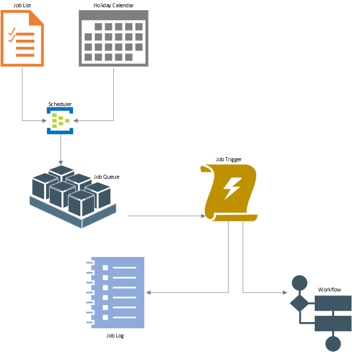
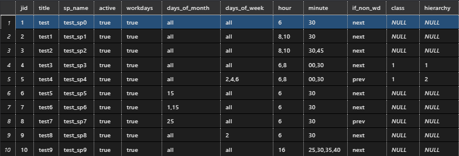
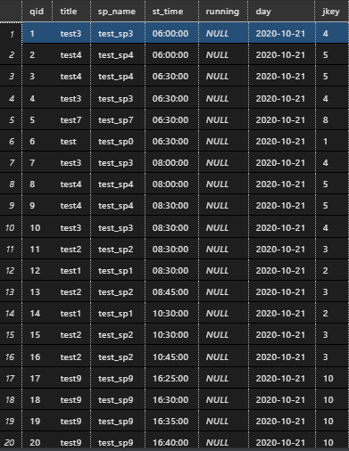

## **Data Flow**

## **Scheduling**

### **Process Flow**

**Jobs Table *(id: 1)*:**

Jobs will be entered into the jobs table (id:1) specified as:
- *title*: text, name of the job
- *sp_name*: text, title of the stored procedure
- *active*: boolean, active status of the job
- *workdays*: boolean, whether or not the job should only run on word days
- *days_of_month*: text, comma separated values indicating the day of month the job should run or ('all','last'); the 'last' notation can be adjusted positively or negatively (e.g. 'last-5') for items that should run relative to the end of the month.
- *days_of_week*: text, comma separated values indicating the day of the week or 'all' (1-7, 1=Sun)
- *hour*: text, comma separated values indicating the hours of the day the job should run (0-24)
- *minute*: text, comma separated values indicating the minute cadence the job should run (00-60)
- *if_non_wd*: boolean (prev/next), if the job falls on a working day this indicates whether the job should run the previous or next working day
- *class*: integer, indicating if the job belongs to a group of dependant jobs
- *hierarchy:* integer, indicating the order the jobs in the hierarchy should be executed

These jobs will be parsed into a job queue based on the scheduling parameters in the following order: monthly, weekly, daily, hourly, and then minutes. In the above example (id:1), job id #2 would become two jobs in the queue to run at 8:30 and 10:30. By contrast, job id #3 would become 8:30, 8:45, 10:30 and 10:45. Both of these jobs would run on every working day of the month, whereas id #5 would only run Monday, Wednesday, and Fridays (2,4,6) and job id #7 would only run on the 15th day of the month (if it lands on a working day). An example of the job queue follows (id:2).

**Job Queue Table *(id: 2)*:**

From this queue, batches of jobs will be collected every five minutes and all jobs that are due (between now and 15 minutes back) will be executed and moved to the job log. Only jobs that have not run or are currently running will be on the job queue, and all jobs that have attempted (completed or failed) will live in the job log.

### **Objects**

#### **Schemas**

*sch*
  - contains all objects for the scheduling process

#### **Tables**

*jobs*
  - Contains the parent job listing, stored procedures, and the cadence parameters used to build the run

*holidays*
  - Contains the scheduled work holidays to be used to determine active work days

*job_queue*
  - The pipeline of jobs to be executed and the scheduled timing of the job

*exec_testing*
  - A test table that contains the test runs

#### **Triggers**

*job_defaults*
  - sets missing values on the jobs table to defaults
  - triggers on inserts to the jobs table

#### **Stored Procedures**

*build_queue*
  - parses the jobs table and creates a listing of the day's jobs and organizes into a queue

*execute_job*
  - collects the jobs from the job_queue table and executes the procedure
